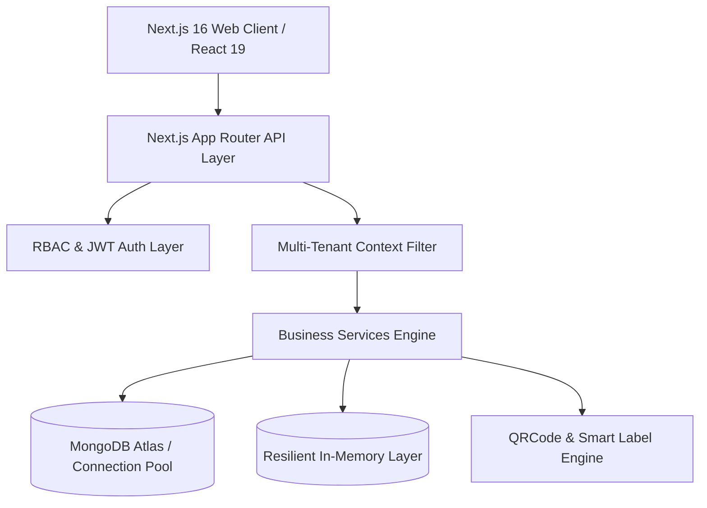

# 🏛️ LIB-MAN Enterprise: System Architecture

## 1. Architectural Overview
LIB-MAN Enterprise is an institutional Multi-Tenant Library Management System built with a layered architecture:

## 2. Core Subsystems

### A. Authentication & RBAC Hierarchy
- **Super Admin**: SaaS Multi-Tenant governance, tenant provisioning, system broadcasts, plan tier configuration.
- **College Admin**: Institution governance, user directory, fine policies, academic year controls, audit trails.
- **Librarian**: Operational library cataloguing, title vs copy management, circulation issue/return, physical stock verification audits, vendor procurement.
- **Student / Faculty / Staff**: Scannable digital BT card pass, OPAC search, active loan tracker, 1-click renewals, hold reservations.

### B. Title vs. Physical Copy Architecture
- Separation of metadata (ISBN, title, author, category, rack) from physical inventory items (individual accession numbers, barcodes, condition states, purchase vendors).

### C. Physical Stock Verification Audit System
- Automated reconciliation comparing expected catalog stock vs barcode-scanned items, generating an instant discrepancy report (*Found*, *Missing*, *Extra*).

### D. Multi-Tenant Data Isolation
- Tenant scoping enforced across all collection queries via `collegeCode` / `collegeId` indexing.
